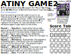
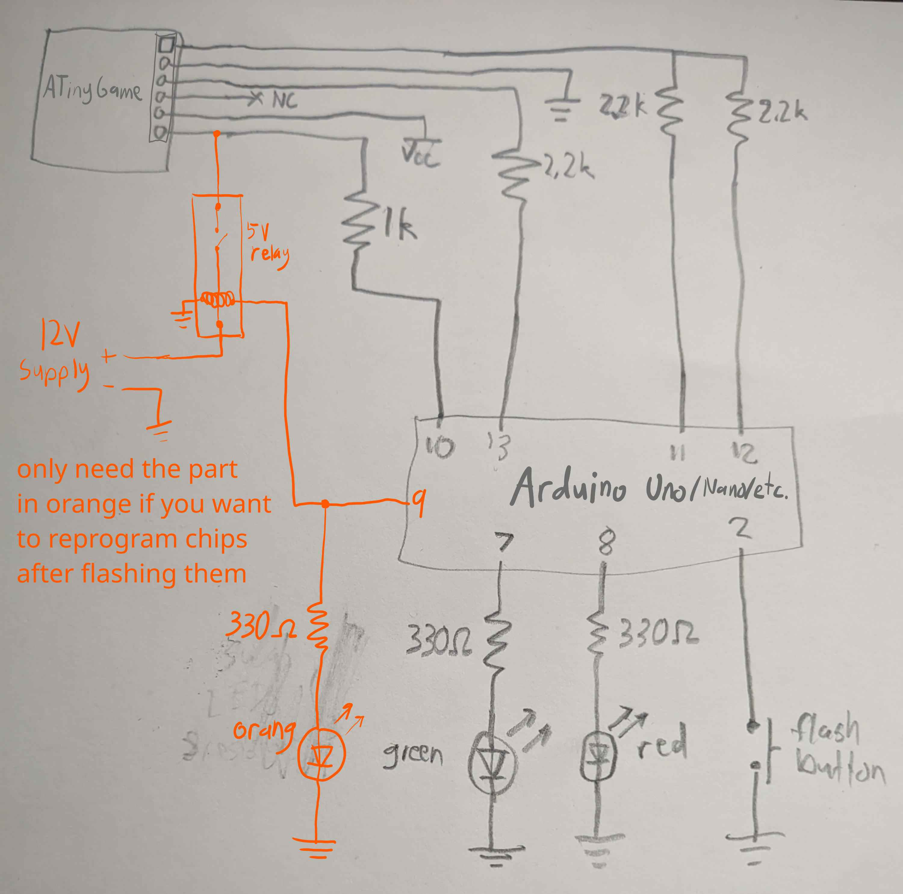

# ATinyGame
See [jjv.sh/atinygame](https://jjv.sh/atinygame) for more info.

## Assembly Code
- [ATinyGame.asm](ATinyGame.asm) - The assembly source code, including comments.
- [ATinyGame.lst](ATinyGame.lst) - The code parsed to resolve labels into concrete memory addresses.
- [ATinyGame.hex](ATinyGame.hex) - The final machine code (with checksums) to be sent over serial to the programmer board, which will flash the ATtiny9.

## Modifying the Code
If you want to modify the code, edit [ATinyGame.asm](ATinyGame.asm), then run `./assemble.sh` to assemble it, which outputs the `ATinyGame.hex` file. See [the ATtiny9 datasheet](https://ww1.microchip.com/downloads/en/DeviceDoc/atmel-8127-avr-8-bit-microcontroller-attiny4-attiny5-attiny9-attiny10_datasheet.pdf) around page 195 for a list of the assembly instructions and what they do.

## Programmer Board
The programmer board uses an Arduino to flash code to the ATtiny9 over SPI. Build this circuit, only making the orange part if you want to be able to program the games more than once (see the "Reprogramming" section for more info):

Then upload the ["ATinyGame Programmer" code](ATinyGame_Programmer/ATinyGame_Programmer.ino) to the Arduino.
If you write your own assembly and want to flash that, you CAN just send it over the serial monitor to the Arduino. But you can also run the [hex_to_array.py](hex_to_array.py) script to convert it to a C array, then paste that into the Arduino code, replacing the existing hardcoded array, and re-upload it. Then you can simply press the button to flash your custom code. Be warned that you will only be able to flash code to it once, unless you follow the steps below.

## Reprogramming
The ATtiny9 has a reset pin that can be reassigned to be an I/O pin, which is much needed since it only has 3 other I/O pins. This is done by setting the "reset" flag, which happens automatically when pressing the flash button, and can be done manually by typing `Sr` in the Arduino serial monitor.

The problem is that this prevents the board from being programmed again, until 12 volts is applied to the reset pin. To do this, build the orange part of the circuit pictured above. If you don't have a 5V relay, you can use a transistor (although I haven't tested this), or a manual on/off switch, or just connect 12V whenever you are about to program it.

Then make sure to upload the ["ATinyGame Programmer HVP (High Voltage Programming)" code](ATinyGame_Programmer_HVP/ATinyGame_Programmer_HVP.ino) to the Arduino, which contains different settings and hardcoded chip type since autodetect doesn't work until the chip is reset. Ideally this would be merged with the main code, but I can't be bothered to test everything again so I avoided changing the main code. Do a diff of the 2 files if you really care. I like this diff program called [meld](https://meldmerge.org/).

> WARNING! Make sure that before you reprogram a board, you desolder the 4 pads on the bottom of the board, effectively disconnecting the 4 ATtiny9 pins from the LEDs and buttons, since they are used to transfer data when programming. This is especially important when applying 12V, as this would probably fry the LEDs! I even made a special rig with relays to let me turn them on and off quickly.

As a bonus, you can even make the whole thing run from the 12V supply by connecting 12V to the `Vin` or `RAW` pin on your Arduino, but be careful not to plug in a USB cable at the same time. I added a switch on mine to connect/disconnect the 12V from `Vin` and I have to remember to turn it off when plugging in USB.
