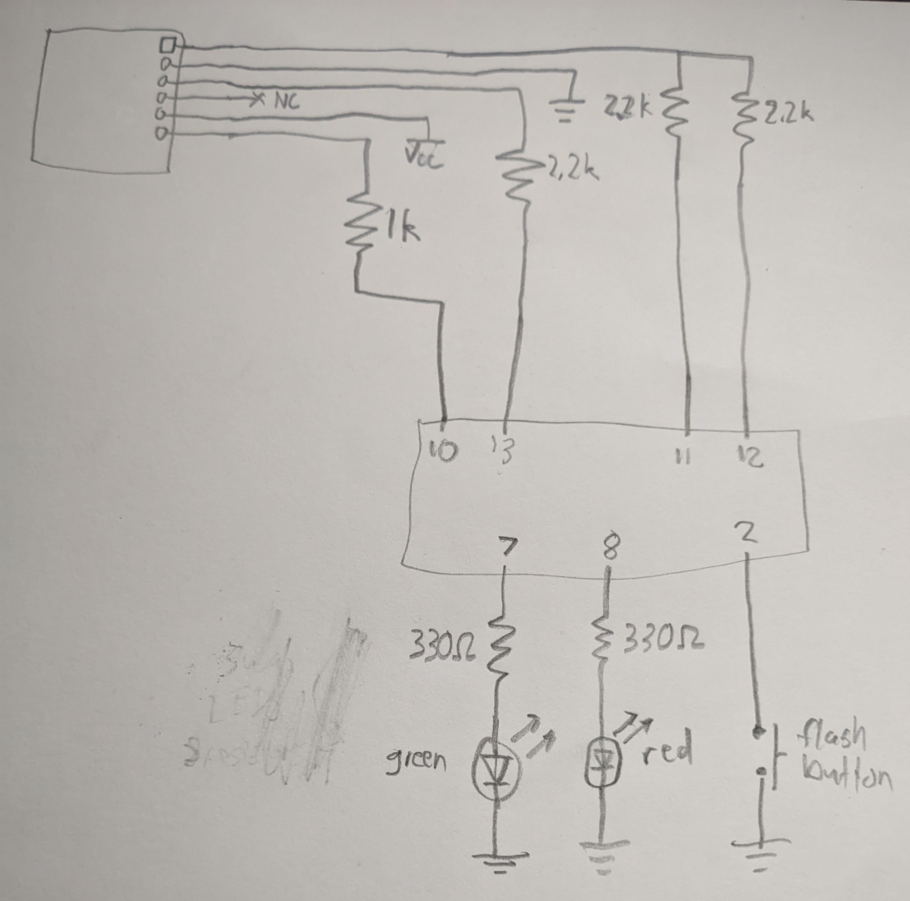

# ATinyGame
See [jjv.sh/atinygame](https://jjv.sh/atinygame) for more info.

## Files
- [ATinyGame.asm](ATinyGame.asm) - The assembly source code, including comments.
- [ATinyGame.lst](ATinyGame.lst) - The code parsed to resolve labels into concrete memory addresses.
- [ATinyGame.hex](ATinyGame.hex) - The final machine code (with checksums) to be sent over serial to the programmer board, which will flash the ATtiny9.

## Programmer
The programmer board uses an Arduino to flash code to the ATtiny9 over SPI. Build this circuit (the Arduino is the box on the bottom): 
Then upload this code to the Arduino: [ATinyGame_Programmer](ATinyGame_Programmer/ATinyGame_Programmer.ino)
If you write your own assembly and want to flash that, you CAN just send it over the serial monitor to the Arduino. But you can also run the [hex_to_array.py](ATinyGame_Programmer/hex_to_array.py) script to convert it to a C array, then paste that into the [Arduino code](ATinyGame_Programmer/ATinyGame_Programmer.ino) and re-upload it. Then you can simply press the button to flash your custom code. Be warned that the button also sets the reset flag (equivalent of sending Sr over serial), so you will have to apply 12V to it to reset it as documented in the ATtiny9 datasheet.
